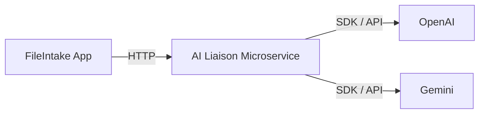

[](https://github.com/JohnnyGitH/FileIntake/actions/workflows/build-and-test.yml)
[](https://codecov.io/gh/JohnnyGitH/FileIntake)

# 📂 FileIntake

**FileIntake** is a C# ASP.NET Core MVC web application that allows users to securely upload PDF files for AI-based analysis and processing.  
It includes user authentication via ASP.NET Core Identity and is built using Entity Framework Core with SQL Server for data persistence.

---
## 🌟 Highlights:

- ☁️ Serverless production deployment on Google Cloud Run
- 🔄 Fully automated CI/CD with UAT → E2E → Production gating
- 🔐 Secure OIDC-based authentication (no service account keys)
- 🧪 95%+ unit test coverage + Playwright E2E validation

---

## 🚀 Application Features

- 🔐 **User Authentication** — Login and registration powered by ASP.NET Core Identity  
- 📤 **File Uploads** — Upload and manage PDF files  
- 🧠 **AI Processing** — Integrates with a companion Python microservice for AI document analysis  
- 🗄️ **Database Integration** — SQL Server via Entity Framework Core  
- 🏗️ **Modular Architecture** — Follows MVC design principles for scalability and maintainability  

---

## 🧰 Tech Stack

| Category | Technology |
|---------|------------|
| **Framework** | ASP.NET Core 8 (MVC) |
| **Backend Language** | C# |
| **ORM** | Entity Framework Core |
| **Database** | SQL Server (Dockerized) |
| **Authentication** | ASP.NET Core Identity |
| **Frontend** | Razor Pages + Bootstrap |
| **Containerization** | Docker & Docker Compose |
| **Cloud Platform** | Google Cloud Run |
| **Container Registry** | Google Artifact Registry |
| **CI/CD** | GitHub Actions |
| **E2E Testing** | NUnit + Microsoft Playwright |
| **Coverage Reporting** | Codecov |
| **Infrastructure Security** | Workload Identity Federation (OIDC) |
| **IDE** | Visual Studio Code |

---

### What it does

- Accepts uploaded PDF/document content from FileIntake  
- Runs AI-based extraction, summarization, and classification  
- Returns structured insights back to FileIntake via REST APIs  

This separation keeps the ASP.NET app clean while isolating heavy AI processing inside a lightweight Python FastAPI microservice.

---

## 🐍  AI Microservice -FastAPI (Python)

This project pairs with the **FileIntake-AIMicroservice-Python** service:

🔗 **Repository:** https://github.com/JohnnyGitH/FileIntake-AIMicroservice-Python

## 🎭 End-to-End Testing (Playwright)

FileIntake includes a dedicated **E2E testing suite** built with:

- 🧪 **NUnit**
- 🎭 **Microsoft Playwright**
- 🌐 Real browser automation against UAT

The E2E tests validate:

- Application availability
- Page load success
- Authentication redirects
- Critical UI elements
- Environment configuration

These tests execute against the **UAT Cloud Run environment** before production deployment.

This ensures production only deploys after full-stack validation passes.


## ☁️ Cloud Architecture

FileIntake runs fully serverless on **Google Cloud Platform**:

- 🐳 **Google Cloud Run** (Web App + AI Microservice)
- 📦 **Google Artifact Registry** (container storage)
- 🔐 **Workload Identity Federation (OIDC)** for secure CI authentication
- 🧹 **Artifact cleanup policies** to reduce registry bloat
- ⚙️ Environment-based configuration

### Benefits

- No long-lived service account keys
- Minimal infrastructure management
- Secure CI/CD authentication
- Scalable containerized architecture


## 🔐 Security Considerations

Security was treated as a first-class concern:

- No secrets committed to source control
- `.env` files ignored
- GitHub Secrets used for sensitive pipeline values
- Workload Identity Federation replaces static credentials
- Separate UAT and Production services
- Artifact retention policies configured
- Branch protection rules enabled


## 🚀 CI/CD & Deployment (Updated)

This service is fully automated using GitHub Actions and Google Cloud.

### Continuous Integration (CI)

- Runs on every pull request
- Executes unit tests
- Publishes coverage reports
- Enforces branch protection rules

### Continuous Deployment (CD)

- Triggered on merge to `master`
- Builds Docker image
- Pushes to Google Artifact Registry
- Deploys to **UAT Cloud Run service**
- Executes E2E tests against UAT
- Deploys to **Production** only if E2E passes

This ensures production deployments are fully validated.

## 🧱 Architecture

```text
┌────────────┐         ┌──────────────────────────┐
│ FileIntake │  HTTP   │ AI Liaison Microservice  │
│ (Main App) ├───────▶│  (FastAPI / Cloud Run)    │
└────────────┘         └─────────────┬────────────┘
                                     │
                                     │ Provider SDKs
                                     ▼
                          ┌────────────────────────┐
                          │ External AI Providers   │
                          │ (OpenAI / Gemini / etc) │
                          └────────────────────────┘
```

The AI Liaison Microservice acts as a boundary between the core application and external AI providers, centralizing authentication, request shaping, and provider-specific logic.



## 🛠️ Local Development

### 1️⃣ Clone the Repository

```bash
git clone https://github.com/JohnnyGitH/FileIntake.git
cd FileIntake
```

---

### 🐳 Running Locally with Docker Compose

FileIntake is fully containerized — both the web app and SQL Server run inside Docker.

### 2️⃣ Start the containers

```bash
docker compose up --build
```

This will:

- Build and run the **FileIntake Web App**
- Run a **SQL Server instance**
- Initialize Identity and sample data via `DbInitializer.cs`
- Persist your data in Docker volumes

The app will be available at:

```
http://localhost:8080
```

### 3️⃣ Stopping containers

```bash
docker compose down
```

### 4️⃣ Resetting EVERYTHING (containers + volumes)

**Use this if Identity keys or DB schema get out of sync**

```bash
docker compose down -v
docker compose up --build
```

---

## 🧪 Accessing the SQL Server Container

```bash
docker exec -it fileintake-sql bash
/opt/mssql-tools18/bin/sqlcmd -S localhost -U sa -P 'YourPasswordHere' -C
```

---

## 🔮 Future Enhancements

The following improvements are planned as the platform evolves:

### ⚡ Performance & Scalability
- Redis caching for AI results (checksum-based caching)
- Rate limiting and throttling via Redis
- Background job processing with Hangfire
- Horizontal scaling strategy improvements

### 🧩 Architecture Evolution
- Event-driven messaging with RabbitMQ
- Dedicated file comparison microservice
- Distributed tracing and structured logging
- Observability and metrics (OpenTelemetry)

### 🔐 Security & Identity
- Two-Factor Authentication (2FA)
- Role-based authorization (Admin / User roles)
- Account lockout & advanced identity policies
- Secure file validation and content scanning

### 📊 Feature Expansion
- Persistent UI display for processed AI results
- File tagging and classification workflows
- Document checksum comparison
- Search and filtering for processed files

### 🧪 Testing & DevOps
- Expanded Playwright E2E coverage
- Contract testing between services
- Canary deployments for production
- Automated rollback strategy

