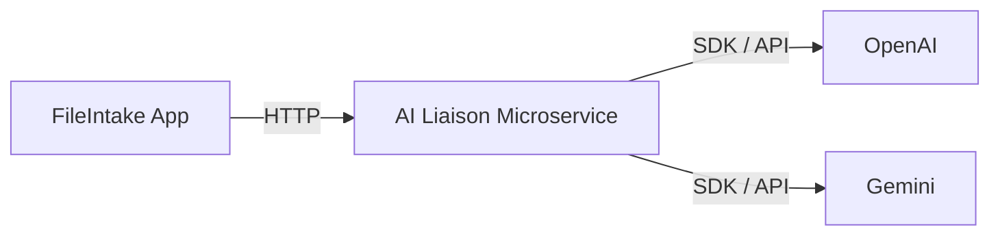

[](https://github.com/JohnnyGitH/FileIntake/actions/workflows/build-and-test.yml)
[](https://codecov.io/gh/JohnnyGitH/FileIntake)

# 📂 FileIntake

**FileIntake** is a C# ASP.NET Core MVC web application that allows users to securely upload PDF files for AI-based analysis and processing.  
It includes user authentication via ASP.NET Core Identity and is built using Entity Framework Core with SQL Server for data persistence.

---

## 🚀 Features

- 🔐 **User Authentication** — Login and registration powered by ASP.NET Core Identity  
- 📤 **File Uploads** — Upload and manage PDF files  
- 🧠 **AI Processing** — Integrates with a companion Python microservice for AI document analysis  
- 🗄️ **Database Integration** — SQL Server via Entity Framework Core  
- 🏗️ **Modular Architecture** — Follows MVC design principles for scalability and maintainability  

---

## 🧰 Tech Stack

| Category | Technology |
|---------|------------|
| **Framework** | ASP.NET Core 8 (MVC) |
| **Backend Language** | C# |
| **ORM** | Entity Framework Core |
| **Database** | SQL Server (Dockerized) |
| **Authentication** | ASP.NET Core Identity |
| **Frontend** | Razor Pages + Bootstrap |
| **Containerization** | Docker & Docker Compose |
| **IDE** | Visual Studio Code |

---

## 🤝 Companion Project — AI Microservice

This project pairs with the **FileIntake-AIMicroservice-Python** service:

🔗 **Repository:** https://github.com/JohnnyGitH/FileIntake-AIMicroservice-Python

### What it does

- Accepts uploaded PDF/document content from FileIntake  
- Runs AI-based extraction, summarization, and classification  
- Returns structured insights back to FileIntake via REST APIs  

This separation keeps the ASP.NET app clean while isolating heavy AI processing inside a lightweight Python FastAPI microservice.

---

## 📦 Running With Docker

FileIntake is fully containerized — both the web app and SQL Server run inside Docker.


## 🚀 CI/CD & Deployment

This service is fully automated using GitHub Actions and Google Cloud:

- **CI**:  
  - Runs on every pull request  
  - Executes unit tests with coverage  
  - Coverage reported to Codecov  

- **CD**:  
  - Triggered on merge to `master`  
  - Builds a Docker image  
  - Pushes to Google Artifact Registry  
  - Deploys to Google Cloud Run  

- **Security**:  
  - Uses **Workload Identity Federation (OIDC)**  
  - No long-lived service account keys  
  - Least-privilege IAM permissions  

This pipeline ensures all changes are tested, reviewed, and safely deployed to production.

## 🧱 Architecture

```text
┌────────────┐         ┌──────────────────────────┐
│ FileIntake │  HTTP   │ AI Liaison Microservice  │
│ (Main App) ├───────▶│  (FastAPI / Cloud Run)    │
└────────────┘         └─────────────┬────────────┘
                                     │
                                     │ Provider SDKs
                                     ▼
                          ┌────────────────────────┐
                          │ External AI Providers   │
                          │ (OpenAI / Gemini / etc) │
                          └────────────────────────┘
```

The AI Liaison Microservice acts as a boundary between the core application and external AI providers, centralizing authentication, request shaping, and provider-specific logic.



## 🛠️ Development Setup

### 1️⃣ Clone the Repository

```bash
git clone https://github.com/JohnnyGitH/FileIntake.git
cd FileIntake
```

---

## 🐳 Running via Docker Compose

### 2️⃣ Start the containers

```bash
docker compose up --build
```

This will:

- Build and run the **FileIntake Web App**
- Run a **SQL Server instance**
- Initialize Identity and sample data via `DbInitializer.cs`
- Persist your data in Docker volumes

The app will be available at:

```
http://localhost:8080
```

### 3️⃣ Stopping containers

```bash
docker compose down
```

### 4️⃣ Resetting EVERYTHING (containers + volumes)

**Use this if Identity keys or DB schema get out of sync**

```bash
docker compose down -v
docker compose up --build
```

---

## 🧪 Accessing the SQL Server Container

```bash
docker exec -it fileintake-sql bash
/opt/mssql-tools18/bin/sqlcmd -S localhost -U sa -P 'YourPasswordHere' -C
```

---

## 🏗️ How the App Works in Docker

- ASP.NET web app mounts a `/keys` folder for Data Protection keys  
- SQL Server stores Identity + File metadata  
- DbInitializer seeds:
  - Test users (`johnny@example.com`, `test@example.com`)
  - Demo user profiles
  - Sample files  
- Hashing + Identity cookie keys stay consistent thanks to key persistence

---

## 🔮 Future Enhancements

- UI for processed AI results  
- File tagging + classification  
- More Identity features (2FA, roles, admin dashboard)  
- CI/CD using GitHub Actions  
- Dockerized microservice coordination for production  
- Additional microservices for more functionality


